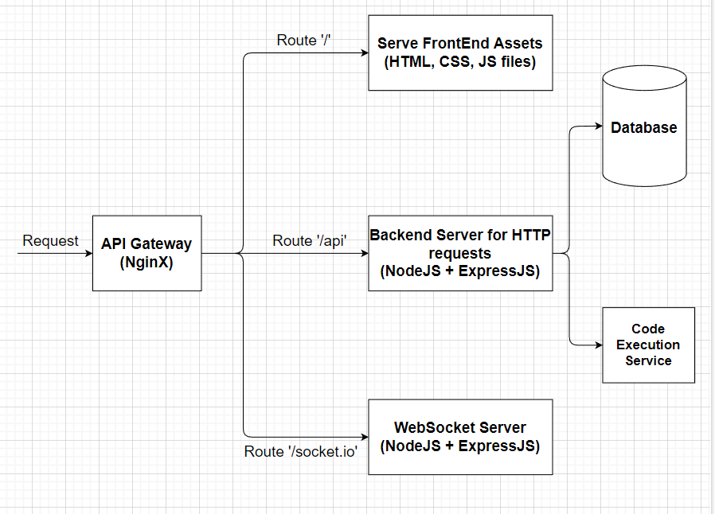

# code-collab
Live at http://ec2-13-232-32-212.ap-south-1.compute.amazonaws.com/
Realtime Code Collaboration Website built using NodeJS (ExpressJS &amp; React). Used Docker for containerization &amp; NginX as Web Server &amp; Reverse Proxy.

- Function Requirements
  - Users can sign up & then login to the application. {Authentication}

- App Architecture

  
